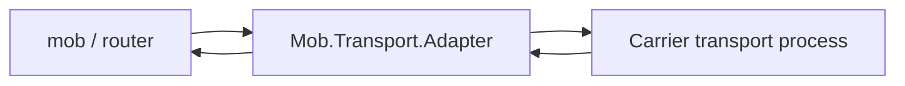

# mob_transport

`mob_transport` is a small reusable transport abstraction layer for `mob`
transport plugins.

It defines:

* a common `Mob.Transport` behaviour
* canonical transport events
* a lightweight `Mob.Transport.Adapter`
* an optional `Mob.Transport.Supervisor`
* telemetry hooks for lifecycle, frame, and error events

It does not include BLE, WiFi, mesh, native, routing, or messaging logic.
Carrier-specific packages such as `mob_ble` implement the behaviour and emit
events to the adapter.

## Installation

```elixir
def deps do
  [
    {:mob_transport, "~> 0.1"}
  ]
end
```

Until the package is published to Hex, use the Git dependency:

```elixir
def deps do
  [
    {:mob_transport, github: "dl-alexandre/mob_transport"}
  ]
end
```

## Flow



The adapter owns one carrier transport process. It forwards outgoing frame calls
to the transport, normalizes incoming carrier events, and sends canonical events
to the configured outer `:event_target`.

## Event Contract

Canonical events forwarded by the adapter:

```elixir
{:transport_up, peer_id, metadata}
{:transport_down, peer_id}
{:frame, peer_id, frame}
{:transport_error, reason}
```

The initial compatibility layer also normalizes current `mob_ble` bridge events:

```elixir
{:ble_peer_up, peer_id, metadata}
{:ble_peer_down, peer_id}
{:ble_frame, peer_id, frame}
```

Malformed frame events return typed normalization errors:

```elixir
{:error, {:invalid_frame, frame}}
```

## Implementing a Transport

A carrier transport implements `Mob.Transport`:

```elixir
defmodule MyApp.LoopbackTransport do
  @behaviour Mob.Transport

  use GenServer

  @impl true
  def start_link(opts), do: GenServer.start_link(__MODULE__, opts)

  @impl true
  def send_frame(transport, peer_id, frame, opts \\ []) do
    GenServer.call(transport, {:send_frame, peer_id, frame, opts})
  end

  @impl true
  def init(opts) do
    {:ok, %{event_target: Keyword.fetch!(opts, :event_target)}}
  end

  @impl true
  def handle_call({:send_frame, peer_id, frame, _opts}, _from, state) do
    send(state.event_target, {:frame, peer_id, frame})
    {:reply, :ok, state}
  end
end
```

Then wrap it with the adapter:

```elixir
{:ok, adapter} =
  Mob.Transport.Adapter.start_link(
    transport: MyApp.LoopbackTransport,
    event_target: self()
  )

:ok = Mob.Transport.Adapter.send_frame(adapter, "peer-id", "payload")
```

See `docs/IMPLEMENTING_A_TRANSPORT.md` for the full carrier checklist.

## Telemetry

The adapter emits:

```elixir
[:mob, :transport, :up]
[:mob, :transport, :down]
[:mob, :transport, :frame, :received]
[:mob, :transport, :frame, :sent]
[:mob, :transport, :error]
```

Example:

```elixir
:telemetry.attach_many(
  "mob-transport-logger",
  [
    [:mob, :transport, :up],
    [:mob, :transport, :down],
    [:mob, :transport, :frame, :sent],
    [:mob, :transport, :error]
  ],
  fn event, measurements, metadata, _config ->
    Logger.info("transport event=#{inspect(event)} measurements=#{inspect(measurements)} metadata=#{inspect(metadata)}")
  end,
  nil
)
```

## Development

```sh
mix deps.get
mix format --check-formatted
mix test
mix credo --strict
mix dialyzer
```
