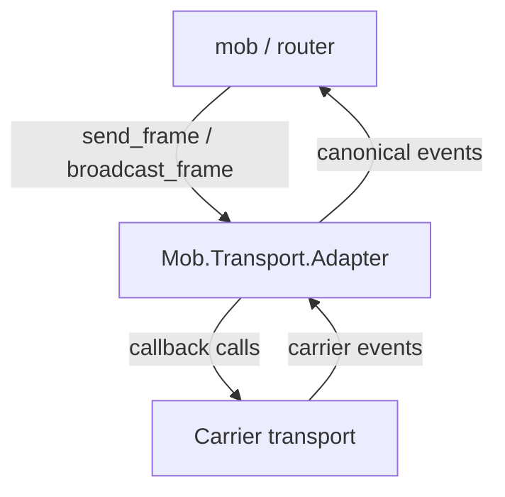
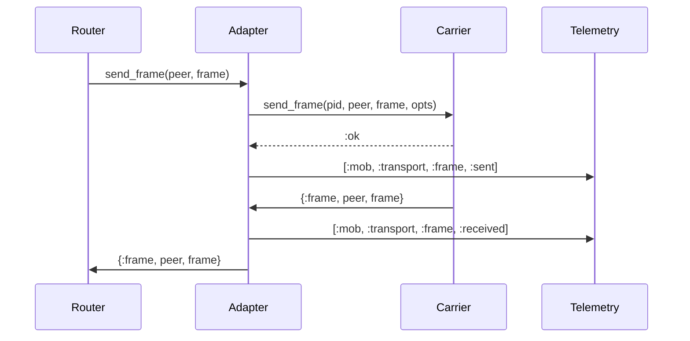

# mob_transport Architecture

`mob_transport` keeps transport integration intentionally atomic.



## Responsibilities

`Mob.Transport` defines the callback contract every carrier plugin implements.

`Mob.Transport.Event` owns normalization from known carrier-specific events into
the canonical tuple contract.

`Mob.Transport.Adapter` owns one transport process, forwards outbound frame
operations to it, receives carrier events, normalizes them, and sends canonical
events to the configured outer `:event_target`.

`Mob.Transport.Supervisor` is a small `DynamicSupervisor` for applications that
want OTP-managed adapter processes.

## Boundaries

This package does not contain transport logic, native code, peer routing,
message persistence, or mesh protocol handling. Those concerns belong in
carrier plugins or in `mob` itself.

## Startup Flow

```elixir
{:ok, adapter} =
  Mob.Transport.Adapter.start_link(
    transport: Mob.Ble.MobileBridge,
    event_target: router_pid,
    local_name: "phone"
  )
```

The adapter replaces the transport's `:event_target` with itself. That ensures
carrier events first pass through normalization before reaching the router.

Additional startup options are passed through to the transport. For cases where
callers need a separate option namespace, `:transport_opts` is merged into the
pass-through options.

## Unknown Events

Unknown events are dropped by default and logged at debug level. Set
`:on_unknown_event` to `:forward_error` to emit:

```elixir
{:transport_error, {:unknown_event, event}}
```

## Telemetry Flow

The adapter emits telemetry after the relevant operation is observed:


